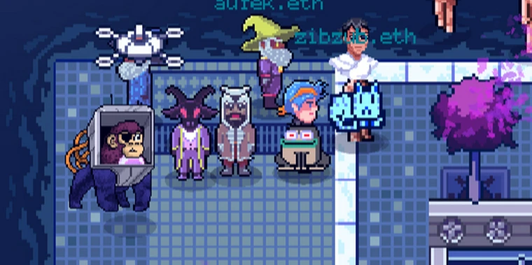
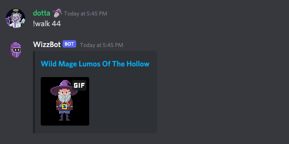
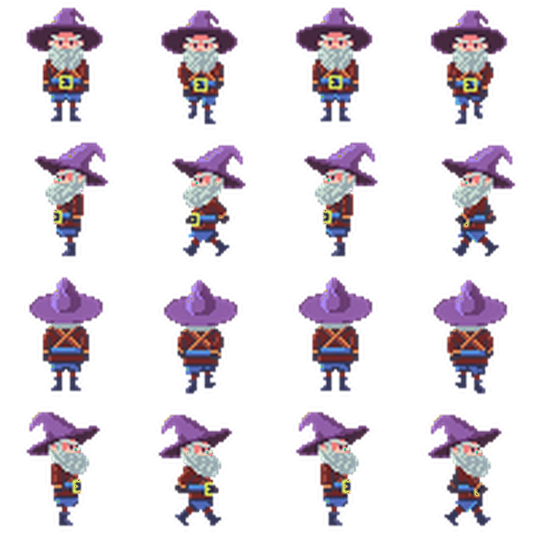

# 2D Walkcycles and Spritesheets

Owning a [Forgotten Runes Wizard](https://www.forgottenrunes.com/gallery) NFT is more than the original 50x50 pixels: it's ownership of a character, and now that character can come to life in any pixel-art metaverse.

<figure><figcaption></figcaption></figure>

Today, we're releasing 10,000 unique walkcycle spritesheets, one for every Wizard in the collection.

We've created an open API so that Wizards can exist in **any metaverse or game that chooses to support them**.

> If you're developer, read to the end of this post for details on how you can integrate these sprites into your game.

### How to Use the Walk Cycles

#### WORLDWIDE WEBB Metaverse

<figure><figcaption></figcaption></figure>

Forgotten Runes Wizards are already available for use in the [WORLDWIDE WEBB Metaverse](https://worldwideweb3.com/).

#### Book of Lore Files

If you'd like to make derivative art, you can find the individual frames for your Wizard by going to your Wizard's page [in the Book of Lore](https://www.forgottenrunes.com/lore/wizards/0/0) and clicking the download link. You can [read more about the Wizard Goodies here](https://www.forgottenrunes.com/posts/goodies)

#### Walkcycle Bot

Thanks to community member [SorcererIlyas "spz"](https://twitter.com/SorcererIlyas) has created a Discord bot that shows an animated gif of your wizard walking. Just use the

`!walk :wizardId` command in our discord

### What is a "Spritesheet"?

A spritesheet is a sequence of images that depicts animation of a character. If a character walks forward, backward, left, and right we need frames of animation for each direction. Here's the walk spritesheet for [Wild Mage Lumos of the Hollow](https://www.forgottenrunes.com/lore/wizards/44/0)

<figure><figcaption></figcaption></figure>

Even accounting for duplicate frames, that is still a lot of art for one simple walk!

And we've created walkcycles **for all 10,000 unique Wizards** in the entire collection.

### API

If you're a developer and you want to integrate these sprites into your app or game, you can find the images by using a URL of the following structure:

`https://www.forgottenrunes.com/api/art/wizards/:wizardId/spritesheet.png`

Where you replace the `:wizardId` with the ID of the Wizard you want. For example. You can find [Wild Mage Lumos of the Hollow (#44)s spritesheet at](https://www.forgottenrunes.com/api/art/wizards/44/spritesheet.png):

`https://www.forgottenrunes.com/api/art/wizards/44/spritesheet.png`

If you'd like a JSON file specifying the locations of the various frames and animation cycles, you can file it at the following URL:

`https://www.forgottenrunes.com/api/art/wizards/:wizardId/spritesheet.json`

Again, you can find [Wild Mage Lumos of the Hollow (#44)s spritesheet metadata at](https://www.forgottenrunes.com/api/art/wizards/44/spritesheet.json):

`https://www.forgottenrunes.com/api/art/wizards/44/spritesheet.json`

The format of this file is an [Asesprite](https://www.aseprite.org/docs/sprite-sheet/) formatted spritesheet. It's a common format that is supported by JavaScript game frameworks like [Phaser](https://phaser.io/examples).


Click "Run Pen" above to play a demo game with the spritesheet


You can [see the source here.](https://codepen.io/cryppadotta/pen/YzxJwjP?editors=0011)

Or [try your own wizard by clicking here](https://codepen.io/cryppadotta/full/YzxJwjP?wizard=44) and changing the `wizard` ID in the URL

### Summary

The walkcycle spritesheets allow Forgotten Runes Wizards to live in any 2D metaverse, and they're just our first step to making Wizards metaverse ready.

Grab your spritesheets, build a game, make some animations, and we'll see you in the metaverse.
