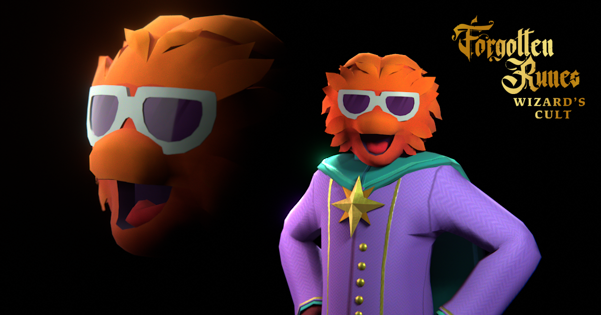
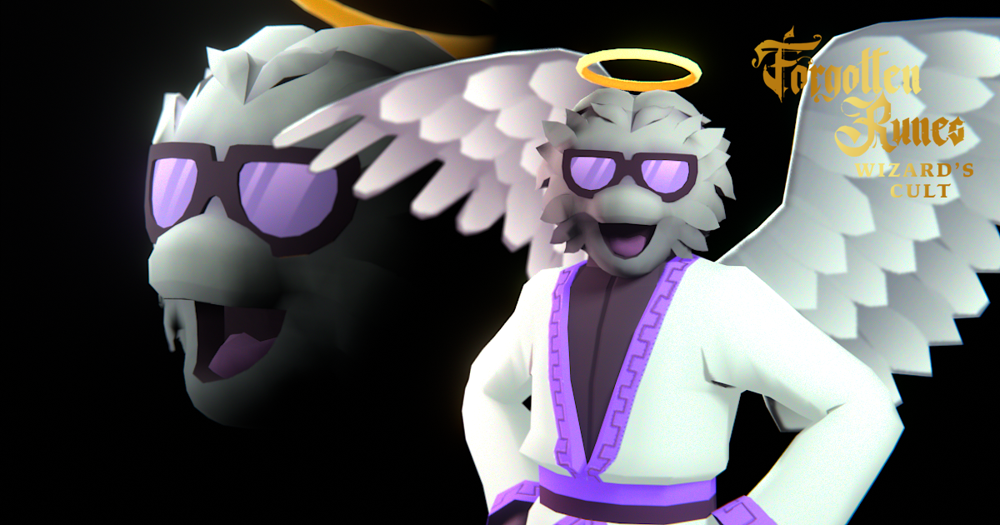

# 3D Integrations Models and Rigs

<figure><figcaption>
Angelic Dotta
</figcaption></figure>

## 3D Models

#### Commercial & Non-Commercial Rights

3D models are available for every single Forgotten Runes Wizard and Forgotten Soul. You are free to integrate these models into your games and creations according to our [Holder IP Rights](ip-rights-commercial-and-derivative-works.md).

### Formats

The models are available in a variety of formats:

* **Blender** - Blender file (`.blend`) for editing in Blender. This file comes with rig controls for animation
* **GLB** - GLTF file (`.gltf`) good for some game engines like Godot or ThreeJS. A-Pose
* **FBX** - FBX file (`.fbx`) good for some game engines like Unity. A-Pose
* **VRM** - VRM file (`.vrm`) good for VTubing and some game engines like Unity. T-Pose

### API URLs

You can access any of the files above for any Wizard or Soul at the following URL

`https://nftz.forgottenrunes.com/dev/3d/:collections/:wizardId/:collection_:wizardId.glb`

For example, you can find the Dotta Wizard at:

`https://nftz.forgottenrunes.com/dev/3d/wizards/6044/wizard_6044.glb`

And the Dotta Soul can be found at:

`https://nftz.forgottenrunes.com/dev/3d/souls/6044/soul_6044.glb`

## Glamour Shots

You can generate a Glamour Shot of any 3D Wizard or Soul like this:

`https://nftz.forgottenrunes.com/dev/3d/:collections/:tokenId/:collection_:tokenId_overlay.png`\
\
For example, get the Dotta Wizard's shot like this:\
`https://nftz.forgottenrunes.com/dev/3d/wizards/6044/wizard_6044_overlay.png`

<figure><figcaption></figcaption></figure>

And you can find the Dotta Soul's shot like this:\
`https://nftz.forgottenrunes.com/dev/3d/souls/6044/soul_6044_overlay.png`

<figure><figcaption></figcaption></figure>
